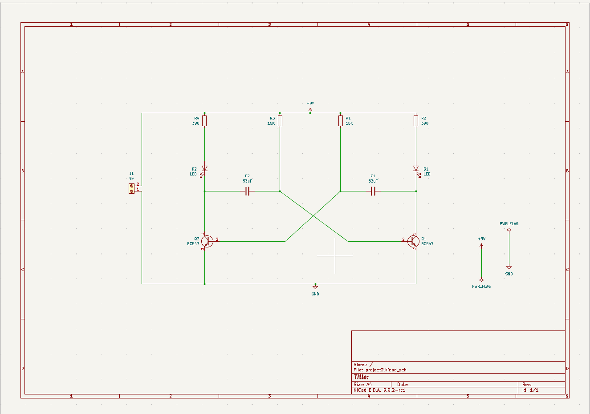
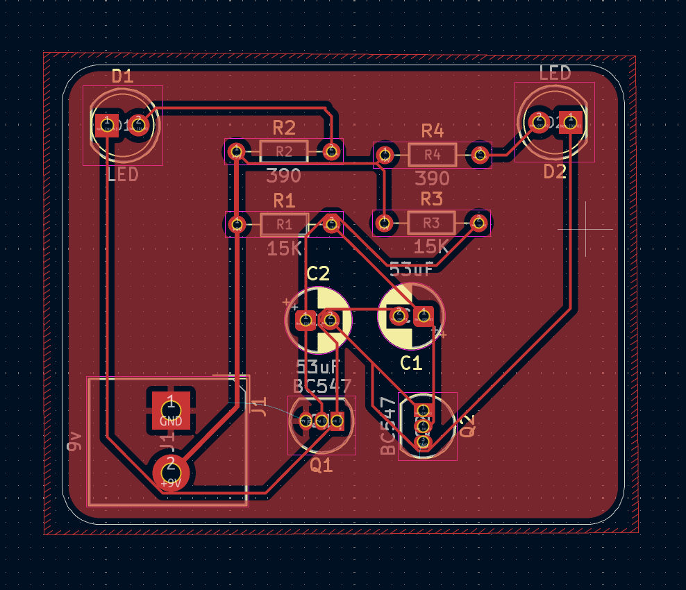
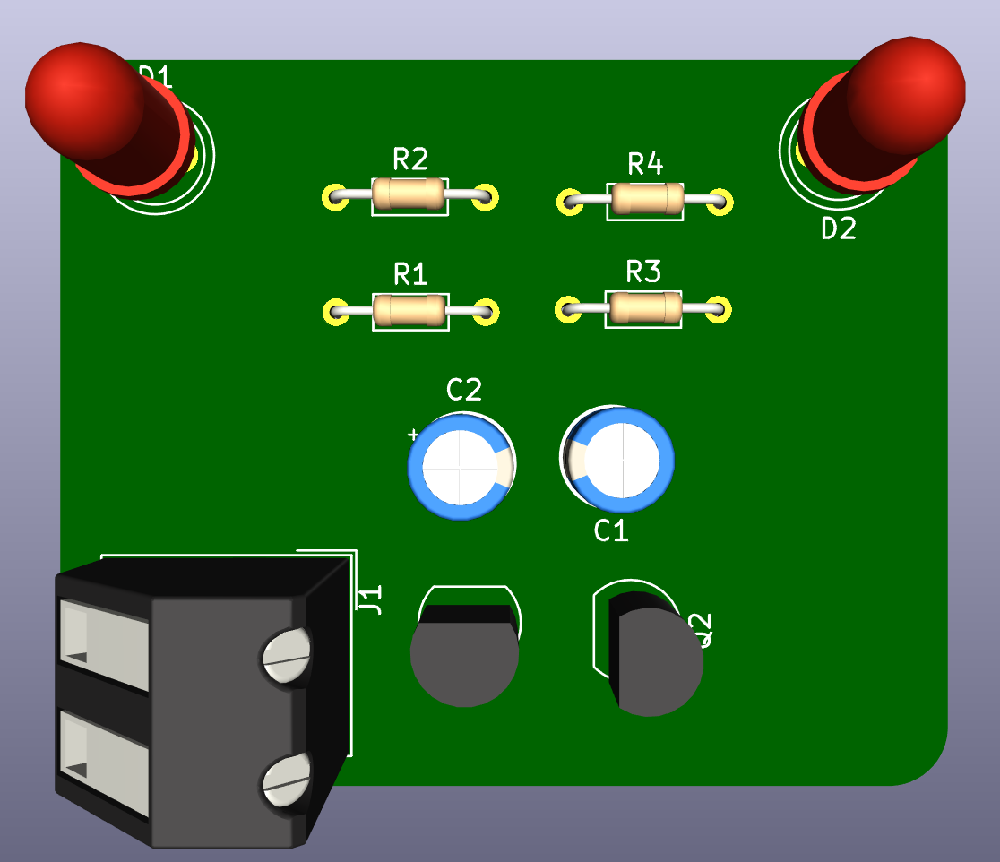

# Astable Multivibrator PCB

## Overview

This project is a transistor-based Astable Multivibrator PCB designed using KiCad 9. The circuit continuously oscillates between two unstable states, causing two LEDs to blink alternately.

## Circuit Description

The circuit consists of:

- 2 × BC547 NPN Transistors
- 2 × LEDs
- 2 × 390 Ω Resistors
- 2 × 15 kΩ Resistors
- 2 × 53 µF Capacitors
- 9 V DC Supply

The transistors are cross-coupled through RC networks. The capacitors alternately charge and discharge, switching the transistors ON and OFF and producing alternate LED blinking.

## Features

- Designed in KiCad 9
- Manual PCB routing
- Through-hole components
- Copper pour
- 3D PCB visualization

## Project Images

### Schematic

### PCB Layout

### 3D PCB View

## Software Used

- KiCad 9
- Git
- GitHub
